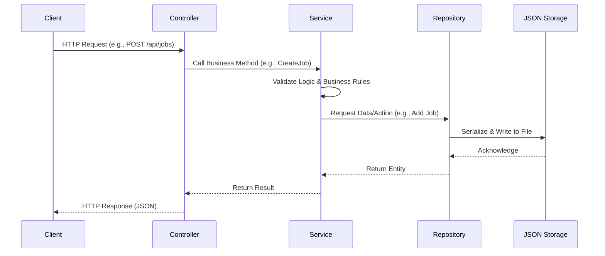
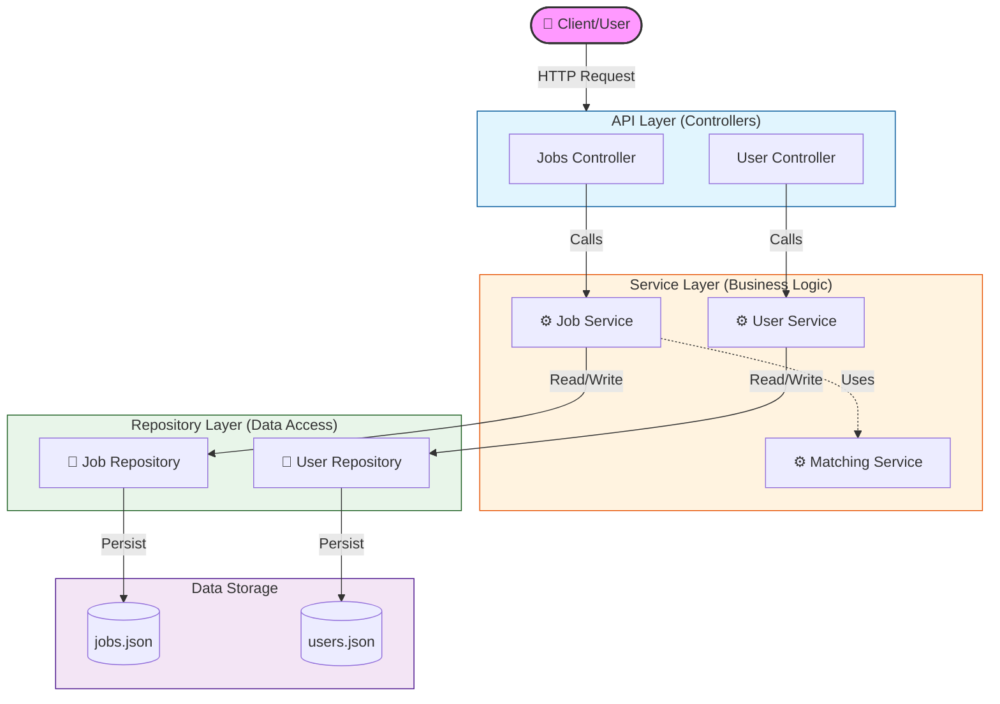

# KerjaNusantara.API

The backend API for the KerjaNusantara application, built with ASP.NET Core.

## Prerequisites

- .NET 9.0 SDK

## Getting Started

1.  Navigate to the API directory:
    ```bash
    cd KerjaNusantara.API
    ```

2.  Restore dependencies:
    ```bash
    dotnet restore
    ```

3.  Run the application:
    ```bash
    dotnet run
    ```

## API Documentation

The API Documentation is available via Swagger UI.
Once the application is running, navigate to:
`https://localhost:<port>/swagger`

(Check the console output for the specific port, typically 5001 or similar).

## Architecture

This project follows a Clean Architecture approach:
-   **KerjaNusantara.Domain**: Core entities.
-   **KerjaNusantara.Repository**: Data access layer.
-   **KerjaNusantara.Services**: Business logic layer.
-   **KerjaNusantara.API**: Entry point, Controllers.

## System Overview & Data Flow

The system uses a layered architecture to ensure separation of concerns. Data flows from the API layer down to the Repository layer for storage, and results bubble back up to the user.

### Architecture Diagram


### Data Flow Diagram



### Component Interaction

1.  **Client Request**: The client sends an HTTP request (GET, POST, PUT, DELETE) to an API Endpoint.
2.  **Controller**: The Controller accepts the request, validates the input format (DTOs), and selects the appropriate Service.
3.  **Service**: The Service applies core business logic—checking permissions, calculating values (e.g., matching scores), and ensuring data integrity.
4.  **Repository**: The Service delegates data persistence to the Repository, which handles the low-level details of reading/writing to the `data/*.json` files.

### High-Level Architecture (Visual)




