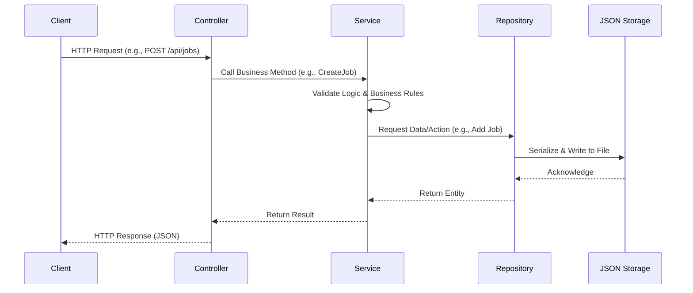

# KerjaNusantara.API

The backend API for the KerjaNusantara application, built with ASP.NET Core.

## Prerequisites

- .NET 9.0 SDK

## Getting Started

1.  Navigate to the API directory:
    ```bash
    cd KerjaNusantara.API
    ```

2.  Restore dependencies:
    ```bash
    dotnet restore
    ```

3.  Run the application:
    ```bash
    dotnet run
    ```

## API Documentation

The API Documentation is available via Swagger UI.
Once the application is running, navigate to:
`https://localhost:<port>/swagger`

(Check the console output for the specific port, typically 5001 or similar).

## Architecture

This project follows a Clean Architecture approach:
-   **KerjaNusantara.Domain**: Core entities.
-   **KerjaNusantara.Repository**: Data access layer.
-   **KerjaNusantara.Services**: Business logic layer.
-   **KerjaNusantara.API**: Entry point, Controllers.

## System Overview & Data Flow

The system uses a layered architecture to ensure separation of concerns. Data flows from the API layer down to the Repository layer for storage, and results bubble back up to the user.

### Architecture Diagram


### Data Flow Diagram



### Component Interaction

1.  **Client Request**: The client sends an HTTP request (GET, POST, PUT, DELETE) to an API Endpoint.
2.  **Controller**: The Controller accepts the request, validates the input format (DTOs), and selects the appropriate Service.
3.  **Service**: The Service applies core business logic—checking permissions, calculating values (e.g., matching scores), and ensuring data integrity.
4.  **Repository**: The Service delegates data persistence to the Repository, which handles the low-level details of reading/writing to the `data/*.json` files.

### High-Level Architecture (Visual)


---

## 📖 API Endpoints & Output Documentation

This section explains the output structure of all API endpoints when accessed via Swagger.

### 🏢 Jobs API

Base route: `/api/jobs`

#### GET `/api/jobs/{id}` - Get Job by ID
Returns a single Job object:
```json
{
  "id": "string (GUID)",
  "title": "Software Engineer",
  "description": "Job description...",
  "companyId": "string",
  "companyName": "Tech Corp",
  "salary": 15000000.0,
  "location": "Jakarta",
  "status": 0,  // 0=Open, 1=Closed, 2=Filled
  "requirements": [
    {
      "skillName": "C#",
      "requiredLevel": 2,  // 0=Beginner, 1=Intermediate, 2=Advanced, 3=Expert
      "isRequired": true
    }
  ],
  "minExperience": 3,
  "postedDate": "2024-01-01T00:00:00",
  "closedDate": null
}
```

#### GET `/api/jobs` - Get All Jobs
**Query Parameters:** `companyId`, `location`, `openOnly`  
Returns an array of Job objects.

#### POST `/api/jobs` - Create Job
**Request Body:**
```json
{
  "companyId": "string",
  "title": "string",
  "description": "string",
  "salary": 0.0,
  "location": "string",
  "minExperience": 0,
  "requirements": [...]
}
```
Returns the created Job object.

#### GET `/api/jobs/applications/{id}` - Get Application
Returns a JobApplication object:
```json
{
  "id": "string",
  "jobId": "string",
  "citizenId": "string",
  "citizenName": "string",
  "status": 0,  // 0=Pending, 1=Accepted, 2=Rejected
  "appliedDate": "2024-01-01T00:00:00",
  "reviewedDate": null,
  "matchScore": 75,
  "coverLetter": "string"
}
```

#### Other Job Endpoints:
- `GET /api/jobs/jobs/{jobId}/applications` - Get all applications for a job
- `POST /api/jobs/applications` - Apply to a job
- `POST /api/jobs/applications/{id}/accept` - Accept application
- `POST /api/jobs/applications/{id}/reject` - Reject application

---

### 👥 Users API

Base route: `/api/users`

#### Citizens

**GET `/api/users/citizens/{id}`** - Returns Citizen object:
```json
{
  "id": "string",
  "name": "John Doe",
  "email": "john@example.com",
  "nik": "1234567890123456",
  "skillProfile": {
    "skills": [
      {
        "skillName": "Python",
        "level": 2,  // Advanced
        "yearsOfExperience": 5
      }
    ]
  },
  "applications": [...],
  "balance": 50000000.0,
  "yearsOfExperience": 5,
  "location": "Jakarta"
}
```

**Other Citizen Endpoints:**
- `GET /api/users/citizens` - Get all citizens
- `POST /api/users/citizens` - Register new citizen

#### Companies

**GET `/api/users/companies/{id}`** - Returns Company object:
```json
{
  "id": "string",
  "name": "string",
  "email": "company@example.com",
  "companyRegistrationNumber": "string",
  "companyName": "Tech Corp",
  "industry": "Technology",
  "postedJobs": [...],
  "tenderBids": [...]
}
```

**Other Company Endpoints:**
- `GET /api/users/companies` - Get all companies
- `POST /api/users/companies` - Register new company

#### Government

**GET `/api/users/governments/{id}`** - Returns Government object with agency details and projects.

**Other Government Endpoints:**
- `GET /api/users/governments` - Get all government agencies
- `POST /api/users/governments` - Register new government agency

---

### 🏗️ Tenders API

Base route: `/api/tenders`

#### GET `/api/tenders/projects/{id}` - Get Project
Returns GovernmentProject object:
```json
{
  "id": "string",
  "title": "Infrastructure Project",
  "description": "string",
  "governmentId": "string",
  "agencyName": "Ministry of Public Works",
  "budget": 1000000000.0,
  "status": 0,  // 0=Open, 1=Closed, 2=Awarded
  "createdDate": "2024-01-01T00:00:00",
  "tenderClosingDate": "2024-12-31T00:00:00",
  "awardedToCompanyId": null,
  "awardedToCompanyName": null
}
```

#### GET `/api/tenders/bids/{id}` - Get Bid
Returns TenderBid object:
```json
{
  "id": "string",
  "projectId": "string",
  "companyId": "string",
  "companyName": "Construction Co",
  "bidAmount": 950000000.0,
  "proposal": "Our proposal...",
  "estimatedDays": 365,
  "submittedDate": "2024-01-01T00:00:00",
  "isWinner": false
}
```

#### Other Tender Endpoints:
- `GET /api/tenders/projects` - Get all projects (filter: `governmentId`, `openOnly`)
- `POST /api/tenders/projects` - Create new project
- `GET /api/tenders/projects/{projectId}/bids` - Get all bids for project
- `POST /api/tenders/bids` - Submit bid
- `POST /api/tenders/projects/{projectId}/award` - Award tender to winning bid

---

### 🎯 Matching API

Base route: `/api/matching`

#### GET `/api/matching/recommendations/{citizenId}` - Get Job Recommendations
**Query Parameters:** `topN` (default: 10)

Returns array of MatchResult objects:
```json
[
  {
    "job": { /* complete Job object */ },
    "citizen": { /* complete Citizen object */ },
    "matchScore": 85,  // 0-100
    "skillGaps": [
      {
        "skillName": "Docker",
        "requiredLevel": 2,
        "currentLevel": 1,
        "gap": 1
      }
    ],
    "recommendation": "Highly Recommended - 85% match"
  }
]
```

**Match Score Interpretation:**
- **70-100**: Highly Recommended
- **50-69**: Good Match
- **30-49**: Potential Match (Training Needed)
- **0-29**: Not Recommended

#### Other Matching Endpoints:
- `GET /api/matching/match/{citizenId}/{jobId}` - Calculate match for specific job
- `GET /api/matching/all/{citizenId}` - Get all matches for citizen

---

### 💰 Payments API

Base route: `/api/payments`

#### GET `/api/payments/{id}` - Get Payment
Returns Payment object:
```json
{
  "id": "string",
  "citizenId": "string",
  "jobId": "string",
  "jobTitle": "Software Engineer",
  "amount": 15000000.0,
  "status": 0,  // 0=Pending, 1=Completed, 2=Failed
  "createdDate": "2024-01-01T00:00:00",
  "completedDate": null,
  "paymentMethod": "Bank Transfer"
}
```

#### Other Payment Endpoints:
- `GET /api/payments/citizen/{citizenId}` - Get all payments for citizen
- `GET /api/payments/citizen/{citizenId}/earnings` - Get total earnings (decimal)
- `POST /api/payments` - Process new payment
- `POST /api/payments/{id}/complete` - Mark payment as completed

---

### 📊 Analytics API

Base route: `/api/analytics`

#### GET `/api/analytics/stats` - Get System Statistics
Returns statistics object:
```json
{
  "totalCitizens": 100,
  "totalCompanies": 25,
  "totalJobs": 50,
  "openJobs": 30,
  "totalApplications": 200,
  "totalProjects": 15,
  "totalBids": 45,
  "employmentRate": 0.65
}
```

#### GET `/api/analytics/dashboard`
Returns: `"Dashboard displayed in server console."`  
(Triggers console output on server side)

---

## 🔢 Enum Reference

| Enum | Values |
|------|--------|
| **JobStatus** | 0=Open, 1=Closed, 2=Filled |
| **ApplicationStatus** | 0=Pending, 1=Accepted, 2=Rejected |
| **TenderStatus** | 0=Open, 1=Closed, 2=Awarded |
| **PaymentStatus** | 0=Pending, 1=Completed, 2=Failed |
| **SkillLevel** | 0=Beginner, 1=Intermediate, 2=Advanced, 3=Expert |

---

## 💡 Common Usage Patterns

### Complete Job Application Flow
1. Register Citizen: `POST /api/users/citizens`
2. Register Company: `POST /api/users/companies`
3. Create Job: `POST /api/jobs`
4. Get Recommendations: `GET /api/matching/recommendations/{citizenId}`
5. Apply to Job: `POST /api/jobs/applications`
6. Accept Application: `POST /api/jobs/applications/{id}/accept`
7. Process Payment: `POST /api/payments`

### Tender Bidding Flow
1. Register Government: `POST /api/users/governments`
2. Create Project: `POST /api/tenders/projects`
3. Submit Bid: `POST /api/tenders/bids`
4. Award Tender: `POST /api/tenders/projects/{projectId}/award`


