# KerjaNusantara - Technical Documentation
## Final Project Report - Object-Oriented Programming

> **Purpose**: This document provides comprehensive technical documentation for the final project report, including architecture explanations, flow diagrams, design patterns, and implementation details.

---

## Table of Contents

1. [Project Architecture](#1-project-architecture)
2. [Console-Based Application](#2-console-based-application)
3. [REST API Implementation](#3-rest-api-implementation)
4. [Refactoring](#4-refactoring)
5. [Design Patterns](#5-design-patterns)
6. [AI Job Recommendation Algorithm](#6-ai-job-recommendation-algorithm)

---

## 1. Project Architecture

### 1.1 Layered Architecture Overview

The KerjaNusantara project follows a **4-layer architecture** pattern, ensuring separation of concerns and maintainability:

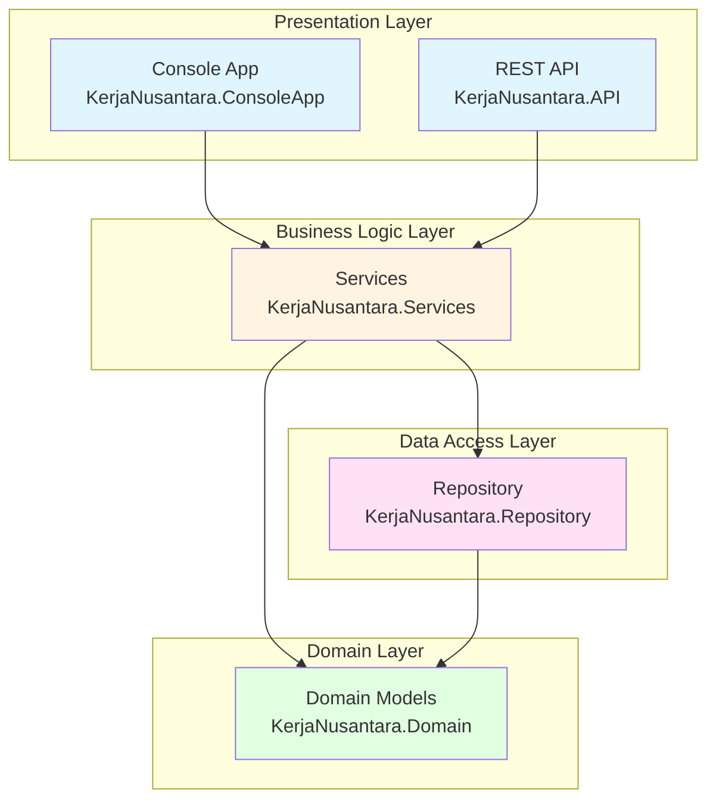

### 1.2 Layer Responsibilities

#### **Domain Layer** (`KerjaNusantara.Domain`)
- **Purpose**: Contains core business entities and domain logic
- **Components**:
  - **Models**: `Citizen`, `Company`, `Government`, `Job`, `JobApplication`, `Payment`, `GovernmentProject`, `TenderBid`
  - **Enums**: `JobStatus`, `ApplicationStatus`, `TenderStatus`, `SkillLevel`, `PaymentStatus`
  - **Interfaces**: `IIdentifiable` (for entities with unique IDs)
- **No Dependencies**: This layer has no dependencies on other layers

#### **Repository Layer** (`KerjaNusantara.Repository`)
- **Purpose**: Handles data persistence and retrieval
- **Pattern**: Repository Pattern implementation
- **Storage**: JSON file-based storage in `data/` directory
- **Components**:
  - `IRepository<T>`: Generic repository interface
  - `JsonRepository<T>`: Generic JSON file implementation
  - Specific repositories: `CitizenRepository`, `CompanyRepository`, `JobRepository`, etc.
- **Dependencies**: Only depends on Domain layer

#### **Services Layer** (`KerjaNusantara.Services`)
- **Purpose**: Contains business logic and orchestrates operations
- **Components**:
  - **User Management**: `UserService` - handles user registration and authentication
  - **Job Management**: `JobService` - manages job postings and applications
  - **Matching**: `MatchingService` - AI-powered job recommendations
  - **Tender Management**: `TenderService` - government project bidding
  - **Payment**: `PaymentService` - payment processing
  - **Analytics**: `AnalyticsService` - employment statistics
  - **Factories**: `UserFactory` - creates user objects (Factory Pattern)
  - **Strategies**: `SkillBasedMatcher` - matching algorithm (Strategy Pattern)
- **Dependencies**: Depends on Repository and Domain layers

#### **Presentation Layer** (Console App & API)
- **Purpose**: User interface and external communication
- **Two Implementations**:
  1. **Console App**: Interactive terminal-based UI
  2. **REST API**: HTTP endpoints for external integration
- **Dependencies**: Depends on Services, Repository, and Domain layers

### 1.3 Data Flow

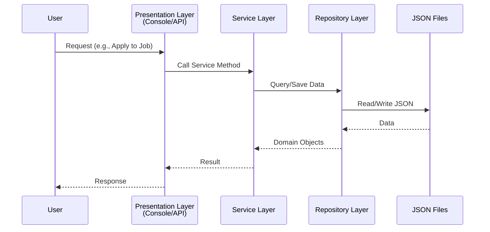

### 1.4 Dependency Injection

The project uses **Microsoft.Extensions.DependencyInjection** for loose coupling:

```csharp
// Example from Program.cs (API)
builder.Services.AddSingleton<IUserRepository<Citizen>, CitizenRepository>();
builder.Services.AddTransient<IUserService, UserService>();
builder.Services.AddTransient<IMatchingStrategy, SkillBasedMatcher>();
```

**Benefits**:
- Loose coupling between layers
- Easy to test (can mock dependencies)
- Easy to swap implementations

---

## 2. Console-Based Application

### 2.1 Main Menu Flow

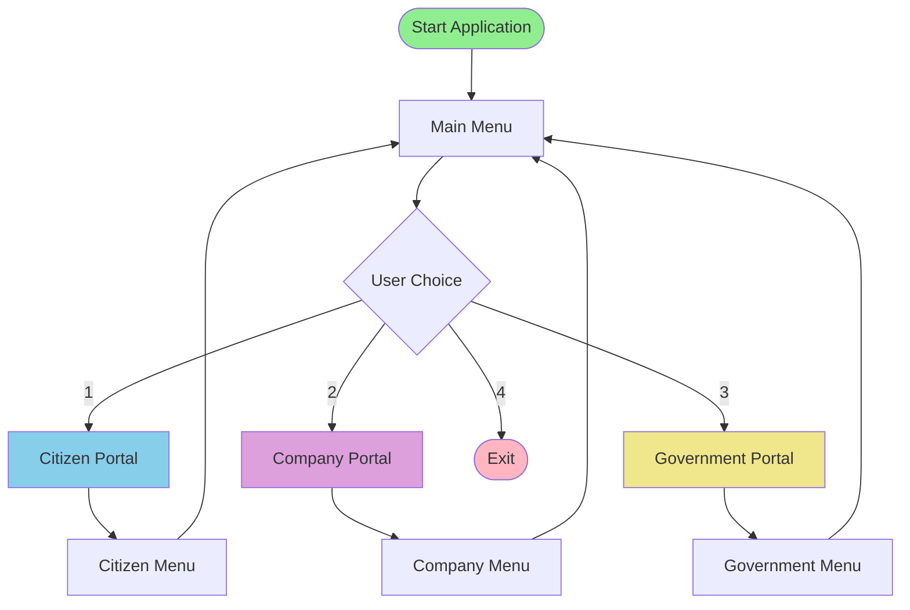

### 2.2 Citizen Portal Flow

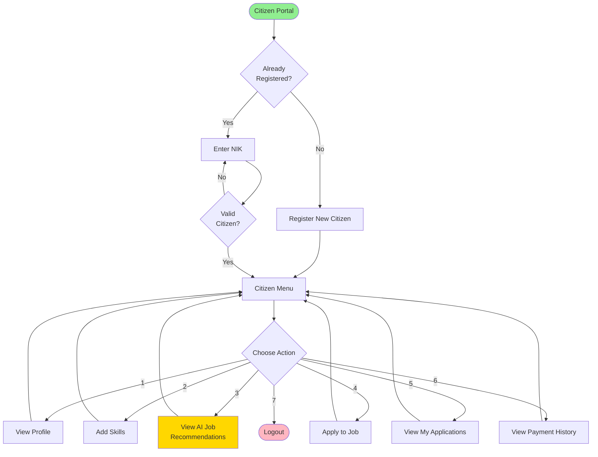

**Key Features**:
1. **Profile Management**: View and update personal information
2. **Skill Management**: Add skills with proficiency levels (Beginner, Intermediate, Advanced, Expert)
3. **AI Job Recommendations**: Get personalized job matches based on skills and experience
4. **Job Applications**: Apply to jobs with cover letters
5. **Application Tracking**: Monitor application status (Pending, Reviewed, Accepted, Rejected)
6. **Payment History**: View payment records

### 2.3 Company Portal Flow

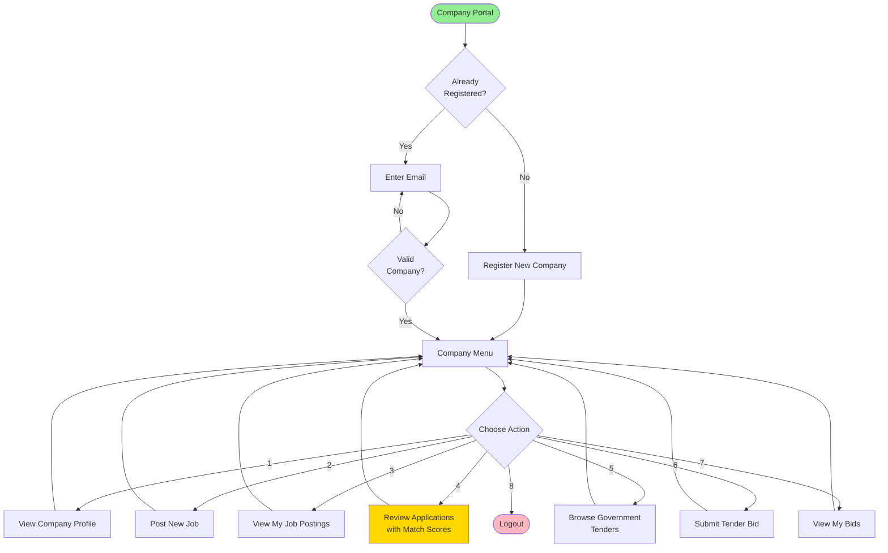

**Key Features**:
1. **Company Profile**: Manage company information
2. **Job Posting**: Create job openings with skill requirements
3. **Application Review**: View applicants with AI-calculated match scores
4. **Tender Browsing**: View government projects
5. **Bid Submission**: Submit proposals for government projects
6. **Bid Tracking**: Monitor bid status

### 2.4 Government Portal Flow

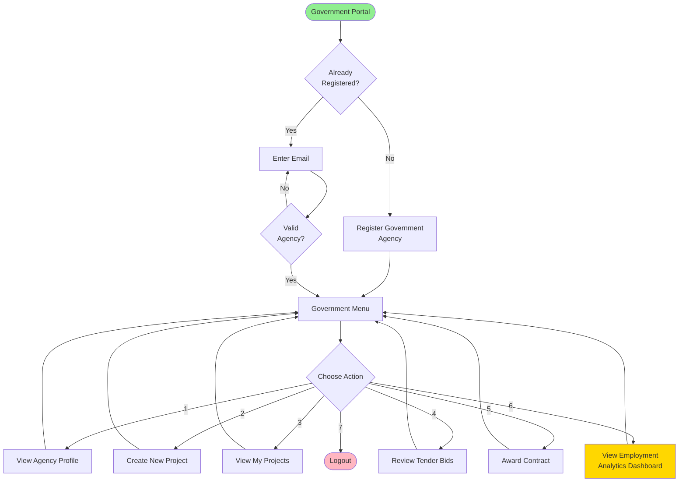

**Key Features**:
1. **Agency Profile**: Manage government agency information
2. **Project Creation**: Create public projects with budgets
3. **Bid Management**: Review and evaluate company bids
4. **Contract Award**: Award contracts to winning companies
5. **Analytics Dashboard**: View employment statistics and insights

### 2.5 Data Flow Diagram

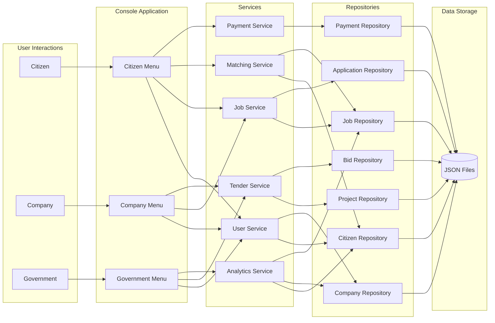

---

## 3. REST API Implementation

### 3.1 API Architecture

The REST API provides HTTP endpoints for external integration, following RESTful principles.

**Base URL**: `http://localhost:5171` (Development)

### 3.2 API Controllers

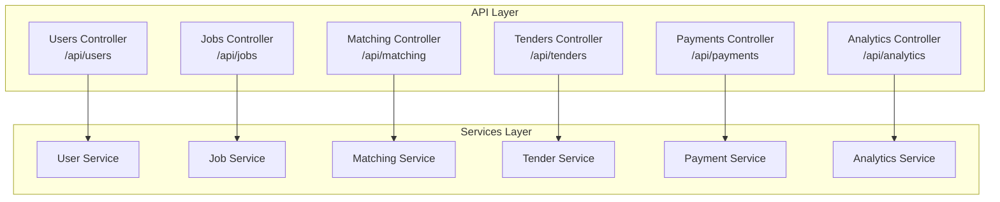

### 3.3 API Endpoints

#### **Users Controller** (`/api/users`)

| Method | Endpoint | Description | Request Body |
|--------|----------|-------------|--------------|
| POST | `/citizens` | Register new citizen | `RegisterCitizenRequest` |
| GET | `/citizens/{id}` | Get citizen by ID | - |
| GET | `/citizens` | Get all citizens | - |
| PUT | `/citizens/{id}` | Update citizen | `UpdateCitizenRequest` |
| POST | `/companies` | Register new company | `RegisterCompanyRequest` |
| GET | `/companies/{id}` | Get company by ID | - |
| GET | `/companies` | Get all companies | - |
| POST | `/governments` | Register government agency | `RegisterGovernmentRequest` |
| GET | `/governments/{id}` | Get government by ID | - |
| GET | `/governments` | Get all governments | - |

#### **Jobs Controller** (`/api/jobs`)

| Method | Endpoint | Description | Request Body |
|--------|----------|-------------|--------------|
| POST | `/` | Create new job posting | `CreateJobRequest` |
| GET | `/{id}` | Get job by ID | - |
| GET | `/` | Get all jobs | - |
| GET | `/open` | Get open jobs | - |
| GET | `/company/{companyId}` | Get jobs by company | - |
| POST | `/apply` | Apply to job | `ApplyToJobRequest` |
| GET | `/applications/{jobId}` | Get job applications | - |
| PUT | `/applications/{id}/status` | Update application status | `status` (query param) |

#### **Matching Controller** (`/api/matching`)

| Method | Endpoint | Description | Request Body |
|--------|----------|-------------|--------------|
| GET | `/recommendations/{citizenId}` | Get AI job recommendations | - |
| GET | `/calculate/{citizenId}/{jobId}` | Calculate match score | - |
| GET | `/all-matches/{citizenId}` | Get all job matches | - |

#### **Tenders Controller** (`/api/tenders`)

| Method | Endpoint | Description | Request Body |
|--------|----------|-------------|--------------|
| POST | `/projects` | Create government project | `CreateProjectRequest` |
| GET | `/projects/{id}` | Get project by ID | - |
| GET | `/projects` | Get all projects | - |
| GET | `/projects/open` | Get open projects | - |
| POST | `/bids` | Submit tender bid | `SubmitBidRequest` |
| GET | `/bids/{projectId}` | Get bids for project | - |
| PUT | `/bids/{id}/award` | Award contract | - |

#### **Payments Controller** (`/api/payments`)

| Method | Endpoint | Description | Request Body |
|--------|----------|-------------|--------------|
| POST | `/` | Process payment | `ProcessPaymentRequest` |
| GET | `/{id}` | Get payment by ID | - |
| GET | `/citizen/{citizenId}` | Get citizen payments | - |

#### **Analytics Controller** (`/api/analytics`)

| Method | Endpoint | Description | Request Body |
|--------|----------|-------------|--------------|
| GET | `/employment-stats` | Get employment statistics | - |

### 3.4 DTOs (Data Transfer Objects)

DTOs are used to define request/response structures:

```csharp
// Example: User DTOs
public record RegisterCitizenRequest(
    string Name, 
    string Email, 
    string NIK, 
    string Location
);

public record RegisterCompanyRequest(
    string Name, 
    string Email, 
    string CompanyName, 
    string RegistrationNumber, 
    string Industry
);

// Example: Job DTOs
public record CreateJobRequest(
    string CompanyId, 
    string Title, 
    string Description, 
    decimal Salary, 
    string Location, 
    int MinExperience, 
    List<SkillRequirement> Requirements
);

public record ApplyToJobRequest(
    string CitizenId, 
    string JobId, 
    string CoverLetter
);
```

### 3.5 API Request/Response Flow

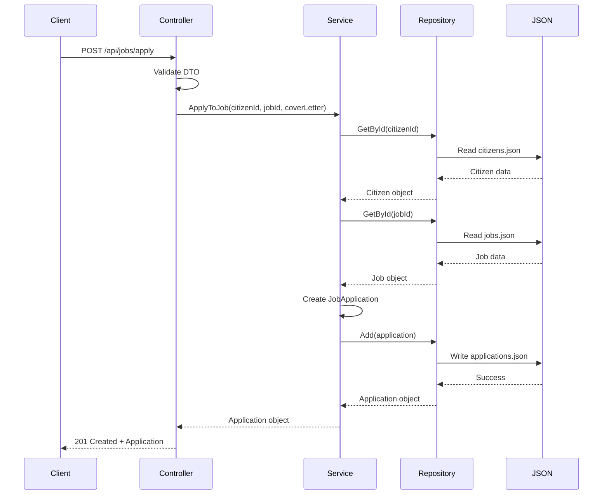

---

## 4. Refactoring

### 4.1 What Was Refactored

The refactoring process improved code quality, maintainability, and adherence to OOP principles.

#### **Before Refactoring Issues**:
1. **Tight Coupling**: Direct dependencies between layers
2. **Code Duplication**: Similar logic repeated across classes
3. **Poor Separation of Concerns**: Business logic mixed with data access
4. **Hard to Test**: Difficult to unit test due to tight coupling

#### **Refactoring Changes**:

##### **1. Introduced Repository Pattern**
- **Before**: Services directly accessed JSON files
- **After**: Created `IRepository<T>` interface and `JsonRepository<T>` implementation
- **Benefit**: Data access logic centralized, easy to swap storage (e.g., to database)

##### **2. Applied Dependency Injection**
- **Before**: Services created their own dependencies using `new`
- **After**: Dependencies injected via constructor
- **Benefit**: Loose coupling, easier testing with mocks

##### **3. Extracted Factory Pattern**
- **Before**: User creation logic scattered across menus
- **After**: Centralized in `UserFactory`
- **Benefit**: Single responsibility, consistent validation

##### **4. Implemented Strategy Pattern**
- **Before**: Matching algorithm hardcoded in service
- **After**: `IMatchingStrategy` interface with `SkillBasedMatcher` implementation
- **Benefit**: Easy to add new matching algorithms without changing existing code

##### **5. Improved Menu Structure**
- **Before**: Large menu classes with mixed responsibilities
- **After**: Separated into smaller, focused classes
- **Benefit**: Better readability and maintainability

### 4.2 Refactoring Example

#### **Before**: Direct JSON Access in Service
```csharp
public class JobService
{
    public void CreateJob(Job job)
    {
        // Direct file access - tight coupling
        var json = File.ReadAllText("data/jobs.json");
        var jobs = JsonSerializer.Deserialize<List<Job>>(json);
        jobs.Add(job);
        File.WriteAllText("data/jobs.json", JsonSerializer.Serialize(jobs));
    }
}
```

#### **After**: Using Repository Pattern
```csharp
public class JobService : IJobService
{
    private readonly IJobRepository _jobRepo;
    
    // Dependency injected
    public JobService(IJobRepository jobRepo)
    {
        _jobRepo = jobRepo;
    }
    
    public void CreateJob(Job job)
    {
        // Abstracted data access
        _jobRepo.Add(job);
    }
}
```

**Benefits**:
- ✅ Loose coupling
- ✅ Easy to test (can mock `IJobRepository`)
- ✅ Can switch to database without changing `JobService`

### 4.3 Code Quality Improvements

| Aspect | Before | After |
|--------|--------|-------|
| **Coupling** | High (tight dependencies) | Low (dependency injection) |
| **Cohesion** | Low (mixed responsibilities) | High (single responsibility) |
| **Testability** | Difficult (hard dependencies) | Easy (mockable interfaces) |
| **Maintainability** | Hard (scattered logic) | Easy (organized structure) |
| **Extensibility** | Difficult (hardcoded logic) | Easy (strategy pattern) |

---

## 5. Design Patterns

The project implements **3 major design patterns** as required:

### 5.1 Repository Pattern

**Purpose**: Abstracts data access logic and provides a collection-like interface for domain objects.

**Implementation**:

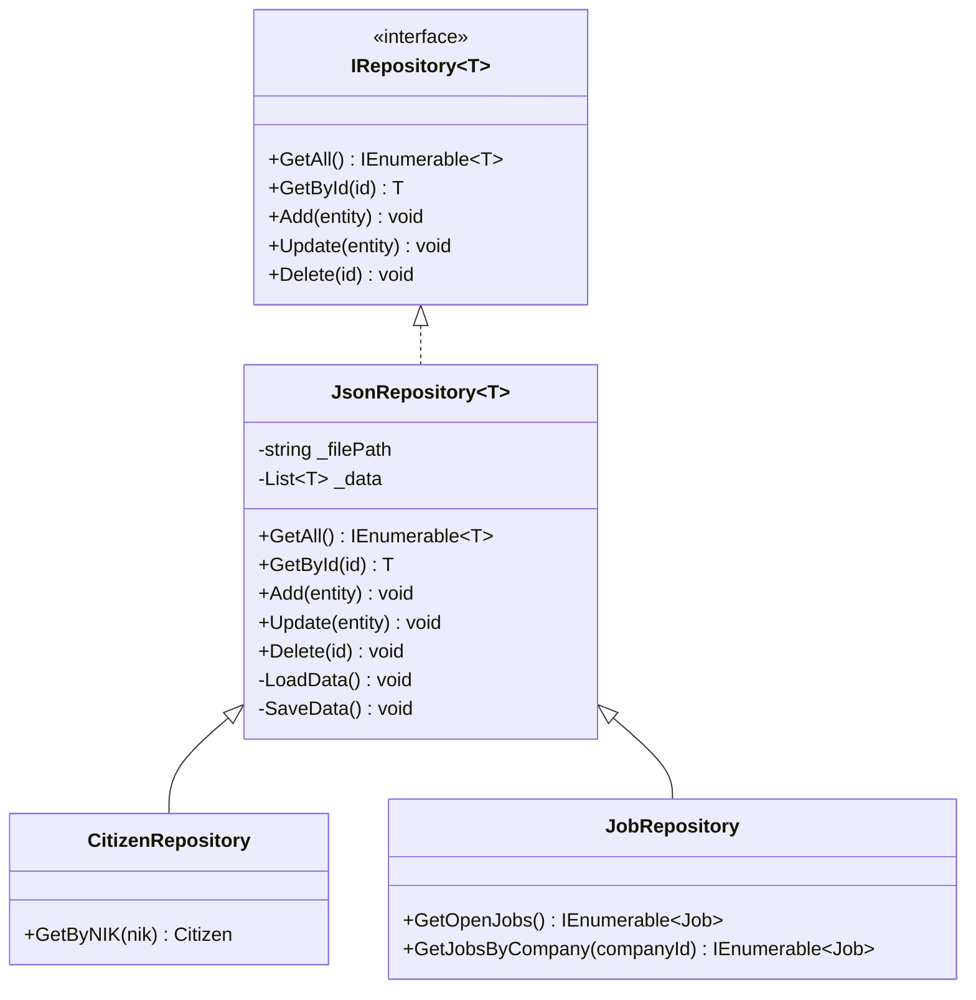

**Code Example**:
```csharp
// Generic repository interface
public interface IRepository<T> where T : IIdentifiable
{
    IEnumerable<T> GetAll();
    T? GetById(string id);
    void Add(T entity);
    void Update(T entity);
    void Delete(string id);
}

// Generic JSON implementation
public class JsonRepository<T> : IRepository<T> where T : IIdentifiable
{
    private readonly string _filePath;
    private List<T> _data;
    
    protected JsonRepository(string fileName)
    {
        _filePath = Path.Combine("data", fileName);
        LoadData();
    }
    
    public virtual IEnumerable<T> GetAll() => _data;
    
    public virtual T? GetById(string id) 
        => _data.FirstOrDefault(x => x.Id == id);
    
    public virtual void Add(T entity)
    {
        _data.Add(entity);
        SaveData();
    }
    
    // ... other methods
}

// Specific repository with custom methods
public class JobRepository : JsonRepository<Job>, IJobRepository
{
    public JobRepository() : base("jobs.json") { }
    
    public IEnumerable<Job> GetOpenJobs()
        => GetAll().Where(j => j.Status == JobStatus.Open);
}
```

**Benefits**:
- ✅ Centralized data access logic
- ✅ Easy to switch storage (JSON → Database)
- ✅ Testable (can create in-memory repository for tests)

### 5.2 Factory Pattern

**Purpose**: Centralizes object creation logic and ensures consistent validation.

**Implementation**:

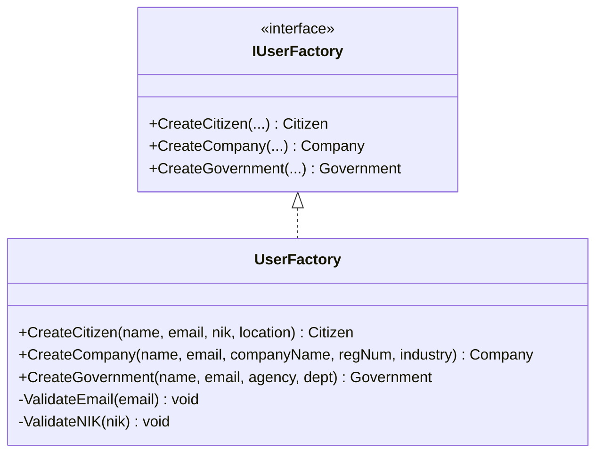

**Code Example**:
```csharp
public interface IUserFactory
{
    Citizen CreateCitizen(string name, string email, string nik, string location);
    Company CreateCompany(string name, string email, string companyName, 
                         string registrationNumber, string industry);
    Government CreateGovernment(string name, string email, string agencyName, 
                               string department);
}

public class UserFactory : IUserFactory
{
    public Citizen CreateCitizen(string name, string email, string nik, string location)
    {
        // Validation
        ValidateEmail(email);
        ValidateNIK(nik);
        
        // Object creation
        return new Citizen
        {
            Id = Guid.NewGuid().ToString(),
            Name = name,
            Email = email,
            NIK = nik,
            Location = location,
            SkillProfile = new SkillProfile(),
            YearsOfExperience = 0
        };
    }
    
    private void ValidateEmail(string email)
    {
        if (!email.Contains("@"))
            throw new ArgumentException("Invalid email format");
    }
    
    private void ValidateNIK(string nik)
    {
        if (nik.Length != 16 || !nik.All(char.IsDigit))
            throw new ArgumentException("NIK must be 16 digits");
    }
    
    // ... other methods
}
```

**Usage**:
```csharp
// In UserService
public class UserService : IUserService
{
    private readonly IUserFactory _factory;
    private readonly IUserRepository<Citizen> _citizenRepo;
    
    public UserService(IUserFactory factory, IUserRepository<Citizen> citizenRepo)
    {
        _factory = factory;
        _citizenRepo = citizenRepo;
    }
    
    public Citizen RegisterCitizen(string name, string email, string nik, string location)
    {
        // Factory handles creation and validation
        var citizen = _factory.CreateCitizen(name, email, nik, location);
        _citizenRepo.Add(citizen);
        return citizen;
    }
}
```

**Benefits**:
- ✅ Centralized validation logic
- ✅ Consistent object creation
- ✅ Single Responsibility Principle

### 5.3 Strategy Pattern

**Purpose**: Defines a family of algorithms, encapsulates each one, and makes them interchangeable.

**Implementation**:

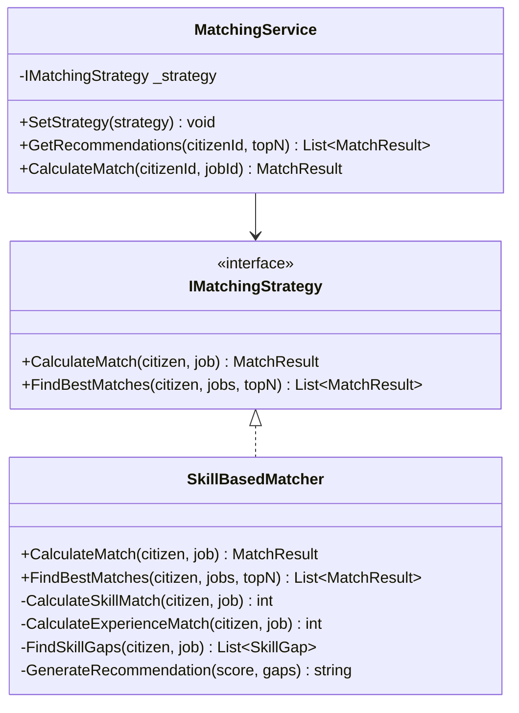

**Code Example**:
```csharp
// Strategy interface
public interface IMatchingStrategy
{
    MatchResult CalculateMatch(Citizen citizen, Job job);
    List<MatchResult> FindBestMatches(Citizen citizen, List<Job> jobs, int topN = 10);
}

// Concrete strategy implementation
public class SkillBasedMatcher : IMatchingStrategy
{
    public MatchResult CalculateMatch(Citizen citizen, Job job)
    {
        // Algorithm: 70% skill match + 30% experience match
        int skillScore = CalculateSkillMatch(citizen, job);
        int experienceScore = CalculateExperienceMatch(citizen, job);
        int totalScore = (int)(skillScore * 0.7 + experienceScore * 0.3);
        
        var skillGaps = FindSkillGaps(citizen, job);
        
        return new MatchResult
        {
            Citizen = citizen,
            Job = job,
            MatchScore = totalScore,
            SkillGaps = skillGaps,
            Recommendation = GenerateRecommendation(totalScore, skillGaps)
        };
    }
    
    // ... helper methods
}

// Context class
public class MatchingService : IMatchingService
{
    private IMatchingStrategy _strategy;
    
    public MatchingService(IMatchingStrategy strategy)
    {
        _strategy = strategy;
    }
    
    // Allows runtime strategy switching
    public void SetStrategy(IMatchingStrategy strategy)
    {
        _strategy = strategy;
    }
    
    public List<MatchResult> GetRecommendations(string citizenId, int topN = 10)
    {
        var citizen = _citizenRepo.GetById(citizenId);
        var openJobs = _jobRepo.GetOpenJobs().ToList();
        
        // Delegate to strategy
        return _strategy.FindBestMatches(citizen, openJobs, topN);
    }
}
```

**Benefits**:
- ✅ Easy to add new matching algorithms (e.g., `LocationBasedMatcher`, `SalaryBasedMatcher`)
- ✅ Can switch algorithms at runtime
- ✅ Open/Closed Principle (open for extension, closed for modification)

**Potential Extensions**:
```csharp
// Future strategy implementations
public class LocationBasedMatcher : IMatchingStrategy { }
public class HybridMatcher : IMatchingStrategy { }
public class MLBasedMatcher : IMatchingStrategy { }
```

---

## 6. AI Job Recommendation Algorithm

### 6.1 Algorithm Overview

The AI job recommendation system uses a **weighted scoring algorithm** to match citizens with jobs based on:
- **Skills** (70% weight)
- **Experience** (30% weight)

### 6.2 Algorithm Flow

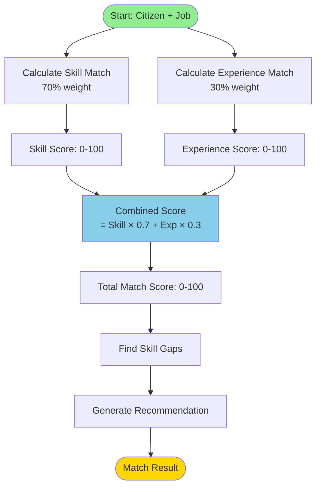

### 6.3 Skill Match Calculation

**Formula**:
```
Skill Score = (Matched Required Skills / Total Required Skills) × 100
```

**Algorithm**:
1. Get all **required** skills from job posting
2. For each required skill:
   - Check if citizen has the skill
   - Check if citizen's skill level ≥ required level
   - If yes, increment matched skills counter
3. Calculate percentage: `(matched / total) × 100`

**Code**:
```csharp
private int CalculateSkillMatch(Citizen citizen, Job job)
{
    // If no requirements, perfect match
    if (job.Requirements.Count == 0)
        return 100;
    
    int matchedSkills = 0;
    int totalRequiredSkills = job.Requirements.Count(r => r.IsRequired);
    
    // If no required skills, perfect match
    if (totalRequiredSkills == 0)
        return 100;
    
    // Check each required skill
    foreach (var requirement in job.Requirements.Where(r => r.IsRequired))
    {
        var citizenSkill = citizen.SkillProfile.GetSkill(requirement.SkillName);
        
        // Skill exists AND level is sufficient
        if (citizenSkill != null && citizenSkill.Level >= requirement.MinimumLevel)
        {
            matchedSkills++;
        }
    }
    
    // Return percentage
    return (matchedSkills * 100) / totalRequiredSkills;
}
```

**Example**:
```
Job Requirements:
- C# (Advanced) - Required
- SQL (Intermediate) - Required
- Docker (Beginner) - Required

Citizen Skills:
- C# (Expert) ✅ Meets requirement
- SQL (Beginner) ❌ Below requirement
- Docker (Intermediate) ✅ Exceeds requirement

Skill Score = (2 matched / 3 total) × 100 = 66.67%
```

### 6.4 Experience Match Calculation

**Formula**:
```
If citizen experience ≥ required: 100%
If citizen experience < required: (citizen experience / required) × 100
```

**Code**:
```csharp
private int CalculateExperienceMatch(Citizen citizen, Job job)
{
    // No experience requirement
    if (job.MinExperience == 0)
        return 100;
    
    // Meets or exceeds requirement
    if (citizen.YearsOfExperience >= job.MinExperience)
        return 100;
    
    // Partial credit for some experience
    return (citizen.YearsOfExperience * 100) / job.MinExperience;
}
```

**Example**:
```
Job Requirement: 5 years experience

Scenario 1: Citizen has 7 years → 100%
Scenario 2: Citizen has 5 years → 100%
Scenario 3: Citizen has 3 years → (3/5) × 100 = 60%
Scenario 4: Citizen has 0 years → 0%
```

### 6.5 Combined Score Calculation

**Formula**:
```
Total Score = (Skill Score × 0.7) + (Experience Score × 0.3)
```

**Code**:
```csharp
public MatchResult CalculateMatch(Citizen citizen, Job job)
{
    // Calculate individual scores
    int skillScore = CalculateSkillMatch(citizen, job);
    int experienceScore = CalculateExperienceMatch(citizen, job);
    
    // Weighted combination
    int totalScore = (int)(skillScore * 0.7 + experienceScore * 0.3);
    
    // ... rest of the method
}
```

**Example**:
```
Skill Score: 66.67%
Experience Score: 60%

Total Score = (66.67 × 0.7) + (60 × 0.3)
            = 46.67 + 18
            = 64.67%
```

### 6.6 Skill Gap Analysis

The algorithm identifies missing or insufficient skills:

**Code**:
```csharp
private List<SkillGap> FindSkillGaps(Citizen citizen, Job job)
{
    var gaps = new List<SkillGap>();
    
    foreach (var requirement in job.Requirements)
    {
        var citizenSkill = citizen.SkillProfile.GetSkill(requirement.SkillName);
        
        var gap = new SkillGap
        {
            RequiredSkillName = requirement.SkillName,
            RequiredLevel = requirement.MinimumLevel,
            CurrentLevel = citizenSkill?.Level,  // null if skill doesn't exist
            TrainingRecommendation = GenerateTrainingRecommendation(
                requirement.SkillName, 
                requirement.MinimumLevel, 
                citizenSkill?.Level
            )
        };
        
        gaps.Add(gap);
    }
    
    return gaps;
}
```

**Training Recommendations**:
```csharp
private string GenerateTrainingRecommendation(
    string skillName, 
    SkillLevel requiredLevel, 
    SkillLevel? currentLevel)
{
    // Skill doesn't exist
    if (!currentLevel.HasValue)
        return $"Learn {skillName} basics to reach {requiredLevel} level";
    
    // Skill exists but insufficient
    if (currentLevel < requiredLevel)
        return $"Improve {skillName} from {currentLevel} to {requiredLevel}";
    
    // Skill meets requirement
    return $"{skillName} skill meets requirements";
}
```

**Example Output**:
```
Skill Gaps:
1. C# (Expert) - Current: Expert ✅
   → "C# skill meets requirements"

2. SQL (Intermediate) - Current: Beginner ⚠️
   → "Improve SQL from Beginner to Intermediate"

3. Docker (Beginner) - Current: None ❌
   → "Learn Docker basics to reach Beginner level"
```

### 6.7 Recommendation Generation

Based on the total score, the algorithm generates human-readable recommendations:

**Code**:
```csharp
private string GenerateRecommendation(int matchScore, List<SkillGap> skillGaps)
{
    var missingSkills = skillGaps.Count(g => !g.HasSkill);
    var insufficientSkills = skillGaps.Count(g => g.HasSkill && g.CurrentLevel < g.RequiredLevel);
    
    if (matchScore >= 70)
        return "Highly recommended! You meet most requirements.";
    
    if (matchScore >= 50)
        return $"Good match. Consider improving {insufficientSkills} skill(s).";
    
    if (matchScore >= 30)
        return $"Potential match. You need to learn {missingSkills} skill(s) and improve {insufficientSkills} skill(s).";
    
    return "Not recommended. Significant skill gaps exist.";
}
```

**Match Levels**:
| Score Range | Level | Recommendation |
|-------------|-------|----------------|
| 70-100% | Highly Recommended | "You meet most requirements" |
| 50-69% | Good Match | "Consider improving X skills" |
| 30-49% | Potential Match | "Need to learn X and improve Y skills" |
| 0-29% | Not Recommended | "Significant skill gaps exist" |

### 6.8 Complete Example

**Scenario**:
```
Job: Senior Software Engineer
- C# (Advanced) - Required
- SQL (Intermediate) - Required
- Docker (Beginner) - Required
- Minimum Experience: 5 years

Citizen: John Doe
- C# (Expert)
- SQL (Beginner)
- Docker (Intermediate)
- Experience: 3 years
```

**Calculation**:
```
1. Skill Match:
   - C# ✅ (Expert ≥ Advanced)
   - SQL ❌ (Beginner < Intermediate)
   - Docker ✅ (Intermediate ≥ Beginner)
   Skill Score = (2/3) × 100 = 66.67%

2. Experience Match:
   - Required: 5 years
   - Has: 3 years
   Experience Score = (3/5) × 100 = 60%

3. Total Score:
   Total = (66.67 × 0.7) + (60 × 0.3)
        = 46.67 + 18
        = 64.67%

4. Skill Gaps:
   - C# (Advanced): ✅ Meets requirements
   - SQL (Intermediate): ⚠️ Improve from Beginner to Intermediate
   - Docker (Beginner): ✅ Exceeds requirements

5. Recommendation:
   "Good match. Consider improving 1 skill(s)."
```

### 6.9 Ranking and Sorting

When finding best matches for a citizen:

**Code**:
```csharp
public List<MatchResult> FindBestMatches(Citizen citizen, List<Job> jobs, int topN = 10)
{
    var matches = new List<MatchResult>();
    
    // Calculate match for each open job
    foreach (var job in jobs)
    {
        if (job.Status == JobStatus.Open)
        {
            var match = CalculateMatch(citizen, job);
            matches.Add(match);
        }
    }
    
    // Sort by match score (descending) and take top N
    return matches
        .OrderByDescending(m => m.MatchScore)
        .Take(topN)
        .ToList();
}
```

**Example Output**:
```
Top 3 Job Recommendations for John Doe:

1. Backend Developer (Match: 85%)
   ✅ Highly recommended! You meet most requirements.
   
2. Full Stack Engineer (Match: 72%)
   ✅ Highly recommended! You meet most requirements.
   
3. Senior Software Engineer (Match: 64%)
   ⚠️ Good match. Consider improving 1 skill(s).
```

---

## Summary

This technical documentation covers:

1. ✅ **Architecture**: 4-layer architecture with clear separation of concerns
2. ✅ **Console App**: Flow diagrams for Citizen, Company, and Government portals
3. ✅ **REST API**: Complete endpoint documentation with DTOs
4. ✅ **Refactoring**: Before/after examples showing improvements
5. ✅ **Design Patterns**: Repository, Factory, and Strategy patterns
6. ✅ **AI Algorithm**: Detailed explanation of the job matching calculation

This documentation provides everything your teammates need to write the final project report!
